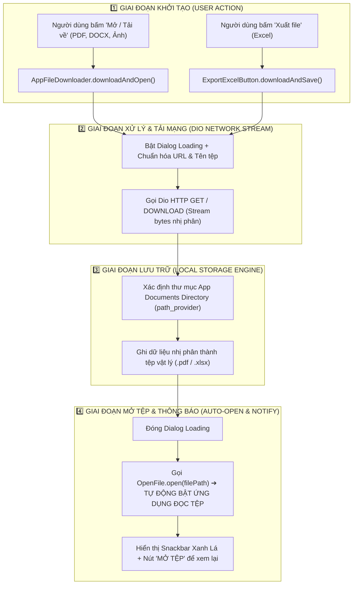
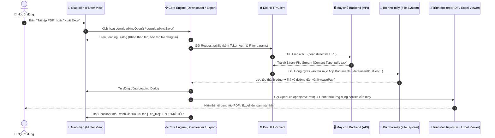

# 📥 HƯỚNG DẪN KIẾN TRÚC & LUỒNG TẢI TỆP TIN & XUẤT EXCEL (FILE DOWNLOAD & EXPORT GUIDE)

> **Phân hệ:** Toàn bộ hệ thống Mobile App (Công việc, Đơn thư, Văn bản giao việc, Báo cáo)  
> **Các thành phần cốt lõi:** `AppFileDownloader`, `ExportExcelButton`, `OpenFile`, `DioHelper`, `path_provider`.

---

## 📑 MỤC LỤC
1. [Tổng quan cơ chế](#1-tổng-quan-cơ-chế)
2. [Sơ đồ luồng hoạt động (Architecture Flow)](#2-sơ-đồ-luồng-hoạt-động-architecture-flow)
3. [Biểu đồ trình tự xử lý (Sequence Diagram)](#3-biểu-đồ-trình-tự-xử-lý-sequence-diagram)
4. [Chi tiết từng thành phần](#4-chi-tiết-từng-thành-phần)
   - [4.1 Tiện ích Tải tệp (AppFileDownloader)](#41-tiện-ích-tải-tệp-tin-appfiledownloader)
   - [4.2 Nút Xuất file Excel (ExportExcelButton)](#42-nút-xuất-file-excel-exportexcelbutton)
5. [Cơ chế lưu trữ & Quyền bộ nhớ trên Android/iOS](#5-cơ-chế-lưu-trữ--quyền-bộ-nhớ-trên-androidios)
6. [Xử lý ngoại lệ & Lỗi kết nối (Error Handling)](#6-xử-lý-ngoại-lệ--lỗi-kết-nối-error-handling)

---

## 1. TỔNG QUAN CƠ CHẾ

Hệ thống cung cấp giải pháp đồng bộ và an toàn 100% cho việc xử lý tệp tin trên điện thoại di động:
* **Tải tệp tin / PDF (`AppFileDownloader`):** Tải các tệp đính kèm, quyết định giao việc, đơn thư từ Server về máy.
* **Xuất báo cáo Excel (`ExportExcelButton`):** Gửi các tiêu chí lọc hiện tại lên API để sinh và tải về bảng tính `.xlsx`.
* **Trải nghiệm người dùng cao cấp (Premium UX):**
  1. Hiển thị Dialog Loading kèm tên tệp để người dùng biết tiến độ.
  2. **Tự động mở file ngay khi tải xong (`OpenFile.open`)** bằng ứng dụng đọc tệp mặc định của điện thoại.
  3. Hiển thị Snackbar màu xanh lá kèm nút **`MỞ TỆP`** tương tác để mở lại bất kỳ lúc nào.

---

## 2. SƠ ĐỒ LUỒNG HOẠT ĐỘNG (ARCHITECTURE FLOW)



---

## 3. BIỂU ĐỒ TRÌNH TỰ XỬ LÝ (SEQUENCE DIAGRAM)



---

## 4. CHI TIẾT TỪNG THÀNH PHẦN

### 4.1 Tiện ích Tải tệp tin (`AppFileDownloader`)
* **Vị trí:** `lib/core/utils/app_file_downloader.dart`
* **Cách sử dụng:**
```dart
AppFileDownloader.downloadAndOpen(
  fileUrl: 'task-assignment-documents/12/download', // hoặc URL đầy đủ https://...
  customFileName: 'VanBanChiDao.pdf',
);
```

---

### 4.2 Nút Xuất file Excel (`ExportExcelButton`)
* **Vị trí:** `lib/core/widgets/export_excel_button.dart`
* **Cách sử dụng bằng Static Function:**
```dart
ExportExcelButton.downloadAndSave(
  url: 'task-assignment-items/export',
  queryParams: {
    'processing_status': controller.selectedStatus.value,
    'search': controller.searchText.value,
  },
  fileNamePrefix: 'DanhSachCongViec',
);
```
* **Cách sử dụng bằng Widget Button trên Header:**
```dart
ExportExcelButton(
  url: 'task-assignment-items/export',
  queryParams: {'processing_status': 'all'},
  fileNamePrefix: 'CongViec',
)
```

---

## 5. CƠ CHẾ LƯU TRỮ & QUYỀN BỘ NHỚ TRÊN ANDROID/IOS

| Nền tảng | Vị trí lưu trữ | Yêu cầu xin quyền (Permissions) |
| :--- | :--- | :--- |
| **Android 11 - 15+** | `getApplicationDocumentsDirectory()` | ❌ Không cần xin quyền MANAGE_EXTERNAL_STORAGE (Không bị Google Play từ chối) |
| **Android 10 trở xuống** | `getApplicationDocumentsDirectory()` | ❌ Tự động có quyền ghi tệp nội bộ của ứng dụng |
| **iOS (iPhone/iPad)** | App Sandbox `NSDocumentDirectory` | ❌ Hoàn toàn an toàn, tự động kích hoạt QuickLook xem tệp |

---

## 6. XỬ LÝ NGOẠI LỆ & LỖI KẾT NỐI (ERROR HANDLING)

1. **Khi rớt mạng hoặc Timeout (> 45s):** Tự động đóng Dialog, bật Snackbar đỏ thông báo lỗi kết nối.
2. **Khi URL tệp bị null hoặc rỗng:** Kiểm tra trước (Pre-check) và thông báo lỗi ngay lập tức, không gửi request vô ích.
3. **Khi máy chủ trả về mã HTTP 404 / 500:** Bắt chính xác mã lỗi HTTP trả về từ Backend.
4. **Khi máy chưa cài app đọc tệp:** Package `open_file` tự động xử lý an toàn, hiển thị hộp thoại chọn ứng dụng của hệ điều hành.
