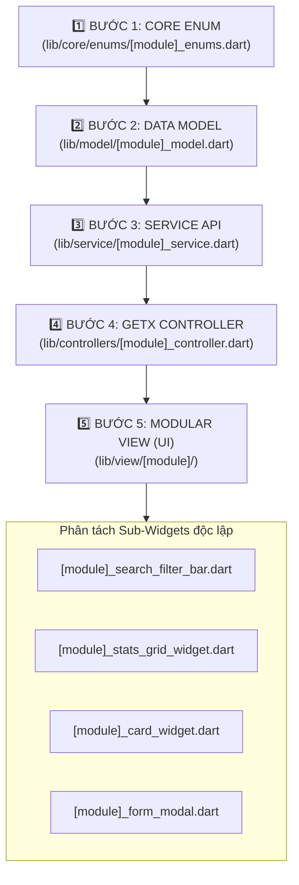

# 🌊 QUY TRÌNH CHUẨN HÓA TẠO MỚI MODULE (MODULE CREATION FLOW)

> **Áp dụng cho:** Toàn bộ thành viên đội ngũ phát triển và AI Coding Agents.  
> **Tiêu chuẩn:** Clean Architecture + GetX State Management + Enum-Driven Design + SWR Smart Loading.

---

## 📑 MỤC LỤC
1. [Sơ đồ luồng 5 bước tổng quan](#1-sơ-đồ-luồng-5-bước-tổng-quan)
2. [Chi tiết từng bước triển khai](#2-chi-tiết-từng-bước-triển-khai)
   - [Bước 1: Khởi tạo Core Enum](#bước-1-khởi-tạo-core-enum-libcoreenums)
   - [Bước 2: Xây dựng Data Model & Stats Model](#bước-2-xây-dựng-data-model--stats-model-libmodel)
   - [Bước 3: Xây dựng Service API](#bước-3-xây-dựng-service-api-libservice)
   - [Bước 4: Xây dựng GetX Controller](#bước-4-xây-dựng-getx-controller-libcontrollers)
   - [Bước 5: Xây dựng Thin View & Sub-Widgets](#bước-5-xây-dựng-thin-view--sub-widgets-libview)
3. [Checklist kiểm tra chất lượng (Definition of Done)](#3-checklist-kiểm-tra-chất-lượng-definition-of-done)

---

## 1. SƠ ĐỒ LUỒNG 5 BƯỚC TỔNG QUAN



---

## 2. CHI TIẾT TỪNG BƯỚC TRIỂN KHAI

---

### BƯỚC 1: Khởi tạo Core Enum (`lib/core/enums/`)
> ⚠️ **Quy tắc bắt buộc:** Tuyệt đối không dùng chuỗi String cứng (`'active'`, `'draft'`) trong UI. Mọi trạng thái, nhãn tiếng Việt, icon và màu sắc phải được định nghĩa tập trung trong Enum.

* **File:** `lib/core/enums/[module_name]_enums.dart`
* **Mẫu chuẩn:**
```dart
import 'package:flutter/material.dart';
import '../../untils/app_colors.dart';

enum SampleModuleStatus {
  all(
    key: 'all',
    label: 'Tất cả',
    icon: Icons.filter_list,
    color: AppColors.primary,
    aliases: ['tat_ca', 'tatca'],
  ),
  active(
    key: 'active',
    label: 'Đang hoạt động',
    icon: Icons.check_circle_outline,
    color: AppColors.done,
    aliases: ['1', 'running', 'dang_hoat_dong'],
  ),
  pending(
    key: 'pending',
    label: 'Chờ duyệt',
    icon: Icons.access_time,
    color: AppColors.paused,
    aliases: ['cho_duyet', 'waiting', 'review'],
  ),
  inactive(
    key: 'inactive',
    label: 'Ngừng hoạt động',
    icon: Icons.cancel_outlined,
    color: AppColors.cancelled,
    aliases: ['0', 'stopped', 'ngung_hoat_dong'],
  );

  final String key;
  final String label;
  final IconData icon;
  final Color color;
  final List<String> aliases;

  const SampleModuleStatus({
    required this.key,
    required this.label,
    required this.icon,
    required this.color,
    this.aliases = const [],
  });

  static final Map<String, SampleModuleStatus> _lookupMap = () {
    final map = <String, SampleModuleStatus>{};
    for (final s in SampleModuleStatus.values) {
      map[s.key.toLowerCase()] = s;
      for (final alias in s.aliases) {
        map[alias.toLowerCase()] = s;
      }
    }
    return map;
  }();

  /// Parse cho Entity (fallback an toàn là 'active')
  static SampleModuleStatus fromKey(
    String? key, {
    SampleModuleStatus fallback = SampleModuleStatus.active,
  }) {
    if (key == null || key.trim().isEmpty) return fallback;
    return _lookupMap[key.toLowerCase().trim()] ?? fallback;
  }

  /// Parse cho Bộ lọc UI (fallback là 'all')
  static SampleModuleStatus fromFilterKey(String? key) {
    return fromKey(key, fallback: SampleModuleStatus.all);
  }

  static List<SampleModuleStatus> get filterOptions => SampleModuleStatus.values;
  static List<SampleModuleStatus> get formOptions =>
      SampleModuleStatus.values.where((e) => e != SampleModuleStatus.all).toList();
}
```

---

### BƯỚC 2: Xây dựng Data Model & Stats Model (`lib/model/`)
> *Mục đích: Parse an toàn dữ liệu JSON từ Backend, hỗ trợ đầy đủ Null-Safety.*

* **File:** `lib/model/[module_name]_model.dart`
* **Mẫu chuẩn:**
```dart
class SampleItemModel {
  final int id;
  final String title;
  final String status;
  final String createdAt;

  SampleItemModel({
    required this.id,
    required this.title,
    required this.status,
    required this.createdAt,
  });

  factory SampleItemModel.fromJson(Map<String, dynamic> json) {
    return SampleItemModel(
      id: json['id'] as int? ?? 0,
      title: json['title'] as String? ?? '',
      status: json['status'] as String? ?? 'active',
      createdAt: json['created_at'] as String? ?? '',
    );
  }

  Map<String, dynamic> toJson() => {
    'id': id,
    'title': title,
    'status': status,
    'created_at': createdAt,
  };
}

class SampleStatsModel {
  final int total;
  final int active;
  final int pending;
  final int inactive;

  SampleStatsModel({this.total = 0, this.active = 0, this.pending = 0, this.inactive = 0});

  factory SampleStatsModel.fromJson(Map<String, dynamic> json) {
    return SampleStatsModel(
      total: json['total'] as int? ?? 0,
      active: json['active'] as int? ?? 0,
      pending: json['pending'] as int? ?? 0,
      inactive: json['inactive'] as int? ?? 0,
    );
  }
}
```

---

### BƯỚC 3: Xây dựng Service API (`lib/service/`)
> *Mục đích: Kết nối Backend qua `DioHelper`, quản lý Exception tập trung.*

* **File:** `lib/service/[module_name]_service.dart`
* **Mẫu chuẩn:**
```dart
import '../core/api_constants.dart';
import '../helper/dio_helper.dart';
import '../model/base_response.dart';
import '../model/[module_name]_model.dart';

class SampleModuleService {
  final DioHelper _http = DioHelper();

  Future<List<SampleItemModel>> getItems({Map<String, dynamic>? params}) async {
    try {
      final response = await _http.get(url: ApiConstants.sampleEndpoint, queryParams: params);
      if (response != null && response is Map<String, dynamic>) {
        final rawList = response['data'] as List? ?? [];
        return rawList.map((e) => SampleItemModel.fromJson(e as Map<String, dynamic>)).toList();
      }
      return [];
    } catch (e) {
      rethrow;
    }
  }

  Future<SampleStatsModel?> getStats() async {
    try {
      final response = await _http.get(url: '${ApiConstants.sampleEndpoint}/stats');
      if (response != null && response is Map<String, dynamic>) {
        return SampleStatsModel.fromJson(response['data'] ?? response);
      }
      return null;
    } catch (_) {
      return null;
    }
  }

  Future<bool> deleteItem(int id) async {
    try {
      final response = await _http.delete(url: '${ApiConstants.sampleEndpoint}/$id');
      return response != null;
    } catch (e) {
      return false;
    }
  }
}
```

---

### BƯỚC 4: Xây dựng GetX Controller (`lib/controllers/`)
> *Mục đích: Quản lý 100% logic và trạng thái phản ứng. Áp dụng chuẩn Smart Loading & Paging.*

* **File:** `lib/controllers/[module_name]_controller.dart`
* **Mẫu chuẩn:**
```dart
import 'package:flutter/material.dart';
import 'package:get/get.dart';
import '../service/[module_name]_service.dart';
import '../model/[module_name]_model.dart';
import '../core/widgets/export_excel_button.dart';

class SampleModuleController extends GetxController {
  final SampleModuleService _service = SampleModuleService();

  // 1. Data Lists & Stats
  final RxList<SampleItemModel> allItems = <SampleItemModel>[].obs;
  final Rx<SampleStatsModel> stats = SampleStatsModel().obs;

  // 2. Search & Filter
  final RxString searchText = ''.obs;
  final RxString selectedStatus = 'all'.obs;

  // 3. Smart Loading & Pagination State
  final RxBool isLoading = true.obs;
  final RxBool isInitialLoaded = false.obs;
  final RxBool isManualRefreshing = false.obs;
  final RxInt currentPage = 1.obs;
  final RxBool isPageChanging = false.obs;
  static const int perPage = 10;

  // 4. Multi-select State
  final RxBool isMultiSelectMode = false.obs;
  final RxSet<int> selectedIds = <int>{}.obs;

  @override
  void onInit() {
    super.onInit();
    loadInitialData();
  }

  Future<void> loadInitialData() async {
    isLoading.value = true;
    try {
      await Future.wait([fetchStats(), fetchItems()]);
    } finally {
      isLoading.value = false;
      isInitialLoaded.value = true;
    }
  }

  Future<void> onRefresh() async {
    isManualRefreshing.value = true;
    currentPage.value = 1;
    await loadInitialData();
    isManualRefreshing.value = false;
  }

  Future<void> fetchItems() async {
    final list = await _service.getItems();
    allItems.assignAll(list);
  }

  Future<void> fetchStats() async {
    final s = await _service.getStats();
    if (s != null) stats.value = s;
  }

  List<SampleItemModel> getFilteredItems() {
    return allItems.where((item) {
      if (searchText.value.isNotEmpty && !item.title.toLowerCase().contains(searchText.value.toLowerCase())) {
        return false;
      }
      if (selectedStatus.value != 'all' && item.status != selectedStatus.value) {
        return false;
      }
      return true;
    }).toList();
  }

  void changePage(int newPage, ScrollController? scrollController) {
    if (newPage == currentPage.value || newPage < 1) return;
    isPageChanging.value = true;
    currentPage.value = newPage;
    if (scrollController != null && scrollController.hasClients) {
      scrollController.animateTo(0, duration: const Duration(milliseconds: 300), curve: Curves.easeOut);
    }
    Future.delayed(const Duration(milliseconds: 250), () => isPageChanging.value = false);
  }

  void exportExcel() {
    ExportExcelButton.downloadAndSave(
      url: 'sample-endpoint/export',
      queryParams: {'status': selectedStatus.value},
      fileNamePrefix: 'DanhSachDuLieu',
    );
  }
}
```

---

### BƯỚC 5: Xây dựng Thin View & Sub-Widgets (`lib/view/[module]/`)
> *Mục đích: Màn hình chính cực kỳ tinh gọn (~200 dòng), giao diện trực quan, chia nhỏ thành các Widget độc lập.*

* **Cấu trúc thư mục:**
```text
lib/view/[module_name]/
├── [module_name]_screen.dart
└── widgets/
    ├── [module_name]_search_filter_bar.dart
    ├── [module_name]_stats_grid_widget.dart
    ├── [module_name]_card_widget.dart
    └── [module_name]_form_modal.dart
```

#### 🔸 [module]_stats_grid_widget.dart (Duyệt qua Enum.values):
```dart
Row(
  children: SampleModuleStatus.values.map((status) {
    final isSelected = controller.selectedStatus.value == status.key;
    return Expanded(
      child: StatCardWidget(
        label: status.label,
        count: _getCount(status),
        icon: status.icon,
        color: status.color,
        isSelected: isSelected,
        onTap: () {
          controller.selectedStatus.value = isSelected ? 'all' : status.key;
          controller.currentPage.value = 1;
        },
        isDark: isDark,
      ),
    );
  }).toList(),
)
```

---

## 3. CHECKLIST KIỂM TRA CHẤT LƯỢNG (DEFINITION OF DONE)

Khi phát triển xong một Module, phải tick đủ 5 tiêu chí trước khi bàn giao:
- [ ] **Enum Coverage:** Đã tạo file Enum trong `lib/core/enums/` và 100% không dùng chuỗi hardcode.
- [ ] **Smart Skeleton:** Màn hình chính dùng `SmartSkeletonWrapper` hiển thị shimmer khi tải lần đầu.
- [ ] **Smooth Paging:** Danh sách thẻ được bọc `AppPagedListWrapper` để chuyển trang êm ái.
- [ ] **Permission Guarding:** Kiểm tra quyền CASL (`AuthController.can(...)`) trước khi hiện nút Thêm/Sửa/Xóa/Xuất Excel.
- [ ] **Clean Compiler:** Chạy `dart analyze` đạt **0 errors** và commit/push lên Git.
