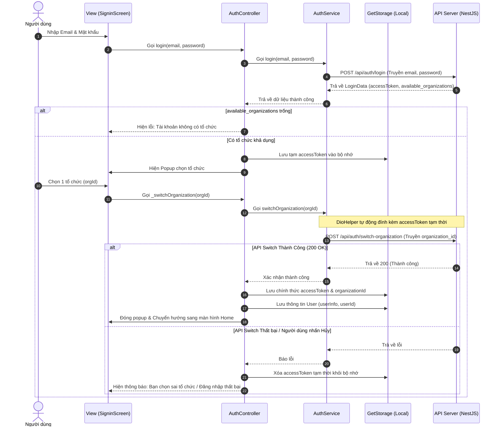

# Project Architecture & Development Guidelines (Skill Instructions)

Tài liệu này định nghĩa cấu trúc kiến trúc, tiêu chuẩn lập trình và luồng nghiệp vụ cốt lõi của dự án **app_baucu_version1**. Mọi lập trình viên hoặc trợ lý AI khi làm việc trên dự án này đều **bắt buộc tuân thủ nghiêm ngặt** các nguyên tắc dưới đây để tránh xảy ra lỗi đồng bộ hoặc cấu trúc.

---

## 1. Mô hình Kiến trúc (MVC + GetX)

Dự án tuân theo mô hình **MVC** kết hợp quản lý trạng thái phản xạ (Reactive State Management) của **GetX**. Mã nguồn được chia thành các lớp rõ rệt:

```
lib/
├── controllers/    # Bộ điều khiển (Logic nghiệp vụ & Trạng thái UI)
├── core/           # Cấu hình tĩnh, hằng số (API Constants)
├── helper/         # Các tiện ích hệ thống (DioHelper, OneSignal)
├── model/          # Định nghĩa cấu trúc dữ liệu (JSON Parsing)
├── service/        # Lớp giao tiếp API và Cơ sở dữ liệu thô
├── untils/         # Giao diện chủ đề (Themes, TextStyles)
└── view/           # Lớp giao diện người dùng (UI screens & widgets)
```

### Nguyên tắc phân lớp:
1. **Model**: Chỉ chứa khai báo thuộc tính, constructor và các hàm `fromJson`/`toJson`. Không chứa logic nghiệp vụ.
2. **Service**: Chỉ chứa các hàm gọi API thông qua `DioHelper` và trả về `BaseResponse<T>`.
3. **Controller**: Gọi Service để lấy dữ liệu, lưu dữ liệu vào các biến `Rx` (`.obs`) và quản lý các trạng thái `isLoading`, `errorMessage`.
4. **View**: Chỉ dùng để xây dựng UI. Sử dụng `Obx` để tự động cập nhật khi trạng thái trong Controller thay đổi. **Tuyệt đối không gọi API trực tiếp từ View**.

---

## 2. Tiêu chuẩn viết Code & Quy ước đặt tên

* **Quy ước đặt tên**:
  * Tên file: Sử dụng chữ thường ngăn cách bằng dấu gạch dưới (snake_case), ví dụ: `auth_controller.dart`, `signin_screen.dart`.
  * Tên Class: Viết hoa chữ cái đầu (PascalCase), ví dụ: `AuthController`, `SigninScreen`.
  * Tên biến & hàm: Viết hoa chữ cái đầu từ thứ hai (camelCase), ví dụ: `isLoading`, `fetchNotifications()`.

* **Quy ước Import (Quan trọng)**:
  * **Không trộn lẫn** giữa import tương đối (`../`) và import tuyệt đối (`package:app_baucu_version1/...`) ở các lớp ngoài thư mục gốc để tránh lỗi chồng chéo thư viện làm biên dịch thất bại.
  * Hãy luôn ưu tiên sử dụng **Import Tuyệt đối (Package Import)**:
    ```dart
    import 'package:app_baucu_version1/controllers/auth_controller.dart';
    ```

---

## 3. Luồng Đăng nhập & Xác thực Tổ chức (Multi-Organization Flow)

Hệ thống hoạt động dựa trên mô hình đa tổ chức làm việc (Multi-Organization). Luồng đăng nhập bắt buộc phải thực hiện theo các bước sau:



### Yêu cầu Header cho các API tiếp theo:
Mọi yêu cầu API sau khi đăng nhập thành công bắt buộc phải chứa 2 header sau trong `DioHelper`:
1. `Authorization: Bearer <accessToken>` (Được tự động nạp từ storage).
2. `X-Organization-Id: <organizationId>` (Được tự động nạp từ storage).

Mã nguồn trong **[dio_helper.dart](file:///c:/LTMB_Tools/class1/project01/app_baucu_version1/lib/helper/dio_helper.dart)** đã cài đặt Interceptor để làm việc này tự động:
```dart
final orgId = _box.read('organizationId');
if (orgId != null) {
  options.headers["X-Organization-Id"] = orgId.toString();
}
```

---

## 4. Quản lý trạng thái bằng GetX

* Luôn kiểm tra sự tồn tại của Controller bằng `Get.find<T>()` trước khi sử dụng để tránh lỗi không tìm thấy Instance.
* Đăng ký khởi tạo tất cả các Controller dùng chung tại file `main.dart` thông qua phương thức `Get.put()`:
  ```dart
  Get.put(ThemeController());
  Get.put(AuthController());
  Get.put(NavigationController());
  Get.put(NotificationController());
  ```
* Sử dụng `Obx(() => ...)` để bọc xung quanh các widget hiển thị dữ liệu thay đổi nhằm lắng nghe các thuộc tính `.obs` từ Controller.
* Để làm mới dữ liệu khi người dùng kéo màn hình xuống, hãy sử dụng `RefreshIndicator` bọc ngoài các `ListView` hoặc `SingleChildScrollView` có thuộc tính `physics: const AlwaysScrollableScrollPhysics()`.

---

## 5. Quy tắc quản lý và sử dụng Bảng màu (Color Palette Rules)

* **Bắt buộc sử dụng màu từ hệ thống**: Mọi màu sắc được sử dụng trên giao diện Trang chủ (HomeScreen), Thống kê (StatisticScreen), các thẻ, nhãn hay biểu đồ bắt buộc phải được khai báo và gọi từ class **`AppColors`** tại file **[`app_colors.dart`](file:///c:/LTMB_Tools/class1/project01/app_baucu_version1/lib/untils/app_colors.dart)**.
* **Tuyệt đối không tự ý tạo màu sắc khác**: Nghiêm cấm sử dụng trực tiếp các constructor màu dạng cứng hoặc mã HEX tùy biến khác (ví dụ: `Color(0xFF...)`) ở các lớp View hoặc Widget. Nếu phát sinh nhu cầu sử dụng màu sắc mới, bắt buộc phải khai báo tĩnh màu đó vào trong `AppColors` trước, sau đó mới gọi sử dụng.

