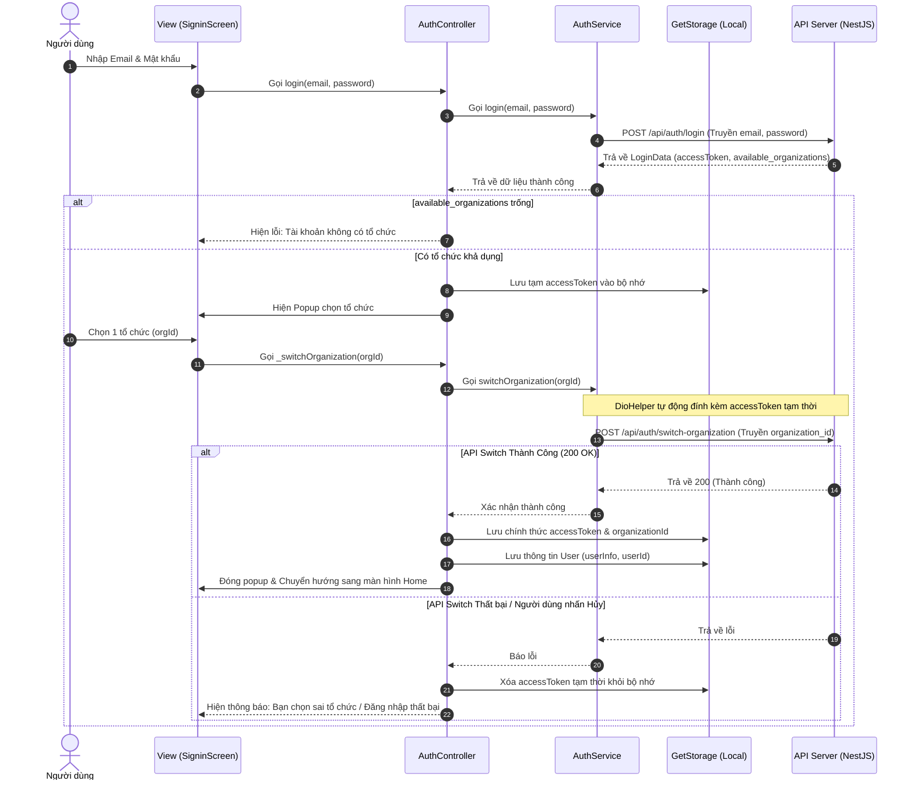
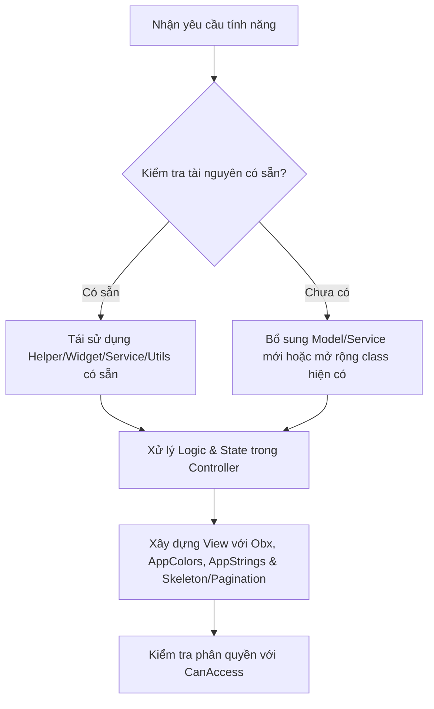

# Project Architecture & Development Guidelines (Skill Instructions)

Tài liệu này định nghĩa cấu trúc kiến trúc, tiêu chuẩn lập trình và luồng nghiệp vụ cốt lõi của dự án **app_baucu_version1**. Mọi lập trình viên hoặc trợ lý AI khi làm việc trên dự án này đều **bắt buộc tuân thủ nghiêm ngặt** các nguyên tắc dưới đây để tránh xảy ra lỗi đồng bộ hoặc cấu trúc.

---

## 1. Mô hình Kiến trúc (MVC + GetX)

Dự án tuân theo mô hình **MVC** kết hợp quản lý trạng thái phản xạ (Reactive State Management) của **GetX**. Mã nguồn được chia thành các lớp rõ rệt:

```
lib/
├── controllers/    # Bộ điều khiển (Logic nghiệp vụ & Trạng thái UI)
├── core/           # Cấu hình tĩnh, hằng số (API Constants)
├── helper/         # Các tiện ích hệ thống (DioHelper, OneSignal)
├── model/          # Định nghĩa cấu trúc dữ liệu (JSON Parsing)
├── service/        # Lớp giao tiếp API và Cơ sở dữ liệu thô
├── untils/         # Giao diện chủ đề (Themes, TextStyles)
└── view/           # Lớp giao diện người dùng (UI screens & widgets)
```

### Nguyên tắc phân lớp:
1. **Model**: Chỉ chứa khai báo thuộc tính, constructor và các hàm `fromJson`/`toJson`. Không chứa logic nghiệp vụ.
2. **Service**: Chỉ chứa các hàm gọi API thông qua `DioHelper` và trả về `BaseResponse<T>`.
3. **Controller**: Gọi Service để lấy dữ liệu, lưu dữ liệu vào các biến `Rx` (`.obs`) và quản lý các trạng thái `isLoading`, `errorMessage`.
4. **View**: Chỉ dùng để xây dựng UI. Sử dụng `Obx` để tự động cập nhật khi trạng thái trong Controller thay đổi. **Tuyệt đối không gọi API trực tiếp từ View**.

---

## 2. Tiêu chuẩn viết Code & Quy ước đặt tên

* **Quy ước đặt tên**:
  * Tên file: Sử dụng chữ thường ngăn cách bằng dấu gạch dưới (snake_case), ví dụ: `auth_controller.dart`, `signin_screen.dart`.
  * Tên Class: Viết hoa chữ cái đầu (PascalCase), ví dụ: `AuthController`, `SigninScreen`.
  * Tên biến & hàm: Viết hoa chữ cái đầu từ thứ hai (camelCase), ví dụ: `isLoading`, `fetchNotifications()`.

* **Quy ước Import (Quan trọng)**:
  * **Không trộn lẫn** giữa import tương đối (`../`) và import tuyệt đối (`package:app_baucu_version1/...`) ở các lớp ngoài thư mục gốc để tránh lỗi chồng chéo thư viện làm biên dịch thất bại.
  * Hãy luôn ưu tiên sử dụng **Import Tuyệt đối (Package Import)**:
    ```dart
    import 'package:app_baucu_version1/controllers/auth_controller.dart';
    ```

---

## 3. Luồng Đăng nhập & Xác thực Tổ chức (Multi-Organization Flow)

Hệ thống hoạt động dựa trên mô hình đa tổ chức làm việc (Multi-Organization). Luồng đăng nhập bắt buộc phải thực hiện theo các bước sau:



### Yêu cầu Header cho các API tiếp theo:
Mọi yêu cầu API sau khi đăng nhập thành công bắt buộc phải chứa 2 header sau trong `DioHelper`:
1. `Authorization: Bearer <accessToken>` (Được tự động nạp từ storage).
2. `X-Organization-Id: <organizationId>` (Được tự động nạp từ storage).

Mã nguồn trong **[dio_helper.dart](file:///c:/LTMB_Tools/class1/project01/app_baucu_version1/lib/helper/dio_helper.dart)** đã cài đặt Interceptor để làm việc này tự động:
```dart
final orgId = _box.read('organizationId');
if (orgId != null) {
  options.headers["X-Organization-Id"] = orgId.toString();
}
```

---

## 4. Quản lý trạng thái bằng GetX

* Luôn kiểm tra sự tồn tại của Controller bằng `Get.find<T>()` trước khi sử dụng để tránh lỗi không tìm thấy Instance.
* Đăng ký khởi tạo tất cả các Controller dùng chung tại file `main.dart` thông qua phương thức `Get.put()`:
  ```dart
  Get.put(ThemeController());
  Get.put(AuthController());
  Get.put(NavigationController());
  Get.put(NotificationController());
  ```
* Sử dụng `Obx(() => ...)` để bọc xung quanh các widget hiển thị dữ liệu thay đổi nhằm lắng nghe các thuộc tính `.obs` từ Controller.
* Để làm mới dữ liệu khi người dùng kéo màn hình xuống, hãy sử dụng `RefreshIndicator` bọc ngoài các `ListView` hoặc `SingleChildScrollView` có thuộc tính `physics: const AlwaysScrollableScrollPhysics()`.

---

## 5. Quy tắc quản lý và sử dụng Bảng màu & Chuỗi văn bản (Colors & Strings)

* **Bắt buộc sử dụng màu từ hệ thống**: Mọi màu sắc được sử dụng trên giao diện bắt buộc phải được khai báo và gọi từ class **`AppColors`** tại file **[`app_colors.dart`](file:///c:/LTMB_Tools/class1/project01/app_baucu_version1/lib/untils/app_colors.dart)**. Tuyệt đối không tự ý viết mã HEX hoặc `Color(0xFF...)` trực tiếp trong View.
* **Bắt buộc sử dụng chuỗi từ AppStrings**: Toàn bộ tiêu đề, nhãn nút, thông báo lỗi/thành công phải gọi từ **`AppStrings`** tại file **[`app_strings.dart`](file:///c:/LTMB_Tools/class1/project01/app_baucu_version1/lib/untils/app_strings.dart)**.

---

## 6. Nguyên tắc DRY & Danh mục Tài nguyên Dùng chung (Resource Reuse Catalog)

**Quy tắc bất di bất dịch**: Luôn kiểm tra và tái sử dụng tài nguyên đã có trong dự án trước khi định nghĩa mới. Chỉ tạo hàm, model, service hoặc widget mới khi dự án chưa có thành phần tương ứng.

### Danh mục tài nguyên cốt lõi cần tái sử dụng:

| Lĩnh vực | File / Thành phần có sẵn | Cách sử dụng / Mục đích |
| :--- | :--- | :--- |
| **API & Network** | `lib/helper/dio_helper.dart` (`DioHelper.dio`) | Gọi API đã cấu hình sẵn Interceptors (Token, Organization-Id). |
| **Response Model** | `lib/model/base_response.dart` (`BaseResponse<T>`) | Định dạng dữ liệu trả về chuẩn từ backend. |
| **Endpoints URL** | `lib/core/api_constants.dart` (`ApiConstants`) | Tập trung tất cả đường dẫn API. |
| **Thông báo (Snackbar)** | `lib/helper/custom_snackbar.dart` (`CustomSnackbar`) | `CustomSnackbar.showSuccess()`, `CustomSnackbar.showError()`, `showWarning()`, `showInfo()`. |
| **Hiệu ứng Loading** | `lib/view/widgets/skeleton_loader.dart`<br>`lib/view/widgets/smart_skeleton_wrapper.dart` | `SkeletonLoader`, `SkeletonBox`, `SkeletonCard`, `SmartSkeletonWrapper` cho trạng thái tải dữ liệu Shimmer. Tuyệt đối không dùng CircularProgressIndicator đơn điệu cho danh sách. |
| **Phân trang danh sách** | `lib/core/widgets/app_pagination_widget.dart` (`AppPaginationWidget`) | Phân trang chuẩn 10 phần tử/trang cho mọi màn hình danh sách. |
| **Kéo làm mới** | `lib/core/widgets/app_refresher.dart` (`AppRefresher`) | Kéo xuống để tải lại dữ liệu. |
| **Phân quyền (CASL)** | `lib/core/widgets/can_access.dart` (`CanAccess`)<br>`lib/controllers/auth_controller.dart` (`authCtrl.can()`) | Kiểm tra quyền hành động (`'create'`, `'read'`, `'update'`, `'destroy'`). |
| **Ô nhập liệu** | `lib/view/widgets/custom_textfield.dart` (`CustomTextField`) | Input chuẩn kèm icon, validation, label. |
| **Thẻ danh mục/Card** | `lib/view/widgets/custom_card.dart` (`CustomCard`) | Card viền bo, đổ bóng chuẩn giao diện dự án. |
| **Thanh tìm kiếm** | `lib/view/widgets/custom_search.dart` (`CustomSearch`) | Ô tìm kiếm dùng chung. |
| **Đường kẻ phân cách** | `lib/core/widgets/app_divider.dart` (`AppDivider`) | Phân cách khối giao diện. |

---

## 7. Quy trình 4 Bước Chuẩn hóa khi Phát triển Tính năng Mới



1. **Bước 1 (Check & Reuse)**: Kiểm tra các thư mục `core/`, `helper/`, `untils/`, `view/widgets/` xem đã có thành phần tương ứng chưa.
2. **Bước 2 (Extend or Create)**: 
   - Nếu đã có Service/Model liên quan: Mở rộng phương thức vào class hiện tại thay vì tạo file mới rời rạc.
   - Nếu là module nghiệp vụ hoàn toàn mới: Tạo mới Model, Service theo đúng mẫu chuẩn của dự án (`BaseResponse`, `DioHelper`).
3. **Bước 3 (State in Controller)**: Quản lý trạng thái bằng `GetxController` (`RxList`, `RxBool`, `RxInt`), xử lý lỗi mạng hiển thị qua `CustomSnackbar`.
4. **Bước 4 (View Implementation)**: Xây dựng UI bằng các widget dùng chung, bọc `Obx`, dùng `SkeletonLoader` cho trạng thái tải lần đầu và `AppPaginationWidget` khi danh sách phân trang.


